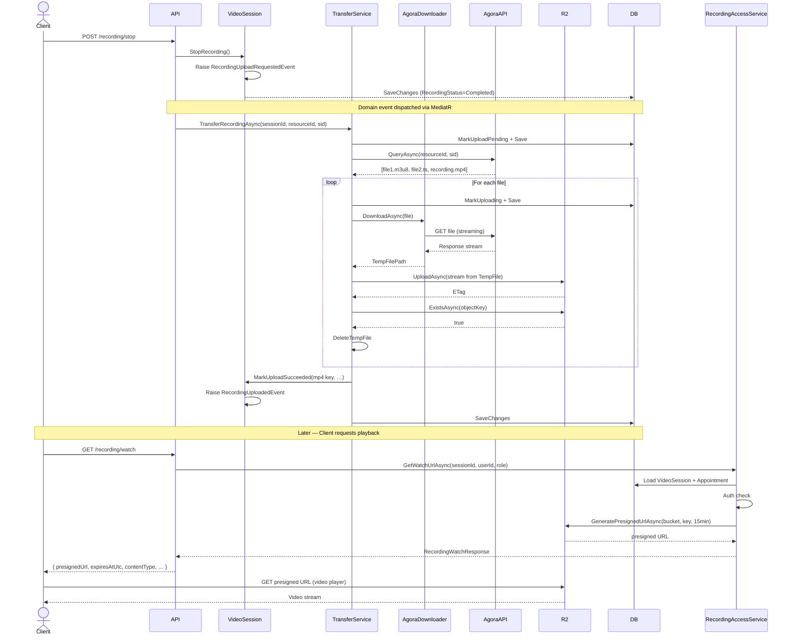

# Recording Playback — Architecture & Developer Guide

> **Last updated:** 2026-07-12  
> **Scope:** Bosla Platform — Video Session recording pipeline (Agora Cloud Recording → Cloudflare R2 → Presigned URL)

---

## Table of Contents
1. [Architecture Overview](#1-architecture-overview)
2. [Recording Lifecycle](#2-recording-lifecycle)
3. [Upload Pipeline](#3-upload-pipeline)
4. [Sequence Diagram — Full Pipeline](#4-sequence-diagram--full-pipeline)
5. [File Selection Strategy](#5-file-selection-strategy)
6. [Authorization](#6-authorization)
7. [Watch Flow](#7-watch-flow)
8. [Download Flow](#8-download-flow)
9. [Presigned URL Lifecycle](#9-presigned-url-lifecycle)
10. [Failure Recovery](#10-failure-recovery)
11. [Cleanup Strategy](#11-cleanup-strategy)
12. [Configuration Reference](#12-configuration-reference)

---

## 1. Architecture Overview

The recording pipeline spans four layers:

```
┌──────────────────────────────────────────────────────────────────────┐
│  Domain                                                              │
│  VideoSession  ←─ owns upload state (UploadStatus, ObjectKey, …)    │
│  RecordingUploadRequestedEvent / RecordingUploadedEvent              │
│  RecordingUploadFailedEvent                                          │
└─────────────────────────┬────────────────────────────────────────────┘
                          │ Domain Events (MediatR)
┌─────────────────────────▼────────────────────────────────────────────┐
│  Application (BoslaPlatform.Service)                                 │
│  RecordingTransferService  — download ▸ upload ▸ verify ▸ persist    │
│  RecordingAccessService    — auth ▸ presigned URL ▸ stream           │
│  IObjectStorage            — provider-agnostic storage abstraction   │
│  IAgoraRecordingDownloader — download from Agora to local temp file  │
└─────────────────────────┬────────────────────────────────────────────┘
                          │ Interface impls
┌─────────────────────────▼────────────────────────────────────────────┐
│  Infrastructure (BoslaPlatform.Infrastructure)                       │
│  AgoraRecordingProvider    — Agora Cloud Recording REST API          │
│  AgoraRecordingDownloader  — HttpClient streaming download           │
│  CloudflareR2ObjectStorage — AWS S3-compatible Cloudflare R2         │
│  TemporaryFileCleanerService — orphan temp-file cleanup job          │
└─────────────────────────┬────────────────────────────────────────────┘
                          │ HTTP
┌─────────────────────────▼────────────────────────────────────────────┐
│  API (BoslaPlatform.API)                                             │
│  GET /api/v1/video-sessions/{id}/recording/watch    — presigned URL  │
│  GET /api/v1/video-sessions/{id}/recording/download — file stream    │
│  GET /api/v1/video-sessions/{id}/recording          — status info    │
└──────────────────────────────────────────────────────────────────────┘
```

---

## 2. Recording Lifecycle

```
VideoSession.Status == Active
         │
         ▼
StartRecording()   ──► RecordingStatus = Recording
                        ScreenRecording entity created
                        AgoraRecordingProvider.StartRecordingAsync()
         │
         ▼
StopRecording()    ──► RecordingStatus = Completed
                        RecordingCompletedEvent raised
                        RecordingUploadRequestedEvent raised
         │
         ▼
[Agora processes on their infrastructure]
         │
         ▼
RecordingUploadRequestedEvent
         │  (handled by RecordingUploadRequestedEventHandler)
         ▼
RecordingTransferService.TransferRecordingAsync()
         │
         ├── UploadStatus = Pending  (persisted)
         ├── QueryAsync() → file list from Agora
         ├── per file: Download → Upload → Verify → Cleanup temp
         ├── SelectPlaybackFile() → MP4 > M3U8 > TS
         ├── VideoSession.MarkUploadSucceeded()
         ├── UploadStatus = Uploaded  (persisted)
         └── RecordingUploadedEvent raised
```

### UploadStatus State Machine

| Status      | Meaning                                                |
|-------------|--------------------------------------------------------|
| `Pending`   | Upload queued, not yet started                         |
| `Uploading` | Currently writing to Cloudflare R2                     |
| `Retrying`  | A transient failure occurred; retry in progress        |
| `Uploaded`  | All files uploaded and verified; ObjectKey is set      |
| `Failed`    | All retry attempts exhausted; LastUploadError is set   |
| `Cancelled` | Upload deliberately cancelled (e.g. session voided)    |

---

## 3. Upload Pipeline

### Step-by-step

```
1.  TransferRecordingAsync receives (sessionId, resourceId, sid)
2.  Load VideoSession from database
3.  Guard: BucketName configured?
4.  session.MarkUploadPending()   → SaveChanges
5.  recordingProvider.QueryAsync() → get file list from Agora
6.  Guard: files available?
7.  for each file:
    a. session.MarkUploading() → SaveChanges
    b. downloader.DownloadAsync()
       • Streams file to temp path (never loads full file to memory)
       • Temp path pattern: bosla_agora_recording_{sessionId}_{index}_{guid}_{name}
    c. ComputeSha256Async() on temp file
    d. ExecuteWithRetryAsync(UploadAsync)
       • Opens FileStream on temp file (no copy)
       • objectStorage.UploadAsync()
       • Exponential back-off between retries
    e. ExecuteWithRetryAsync(ExistsAsync)
       • Confirms object exists in R2 after upload
    f. Collect UploadedRecordingFile metadata
    g. finally: DeleteTempFile() — even if upload failed
8.  SelectPlaybackFile() → priority: MP4 > M3U8 > TS
9.  session.MarkUploadSucceeded(storageProvider, bucket, objectKey, …)
10. session.AddDomainEvent(RecordingUploadedEvent)
11. SaveChanges   → domain events dispatched via MediatR outbox
```

### Metadata persisted on VideoSession

| Property           | Example value                          | Notes                     |
|--------------------|----------------------------------------|---------------------------|
| `StorageProvider`  | `CloudflareR2`                         | Enum (string in DB)       |
| `BucketName`       | `bosla-recordings`                     | From `StorageOptions`     |
| `ObjectKey`        | `{sessionId}/recording.mp4`            | Never a presigned URL     |
| `ContentType`      | `video/mp4`                            | MIME type                 |
| `ContentLength`    | `52428800`                             | Bytes                     |
| `ChecksumSha256`   | `a3f1…`                                | Hex, lowercase            |
| `ETag`             | `"abc123"`                             | From R2 PutObject         |
| `VersionId`        | `null` (R2 default bucket)             | Populated if versioning   |
| `UploadedAtUtc`    | `2026-07-12T07:30:00Z`                 |                           |
| `UploadAttempts`   | `1`                                    | Incremented per attempt   |
| `LastUploadError`  | `null` on success                      |                           |

> **Important:** `ObjectKey` is stored, never a presigned URL. Presigned URLs are generated on-demand and are ephemeral.

---

## 4. Sequence Diagram — Full Pipeline



---

## 5. File Selection Strategy

When Agora returns multiple recording files (common with HLS output), the service selects a single **playback file** to store as the primary `ObjectKey` using the following priority:

| Priority | Extension | Content-Type                       | Why                                  |
|----------|-----------|-------------------------------------|--------------------------------------|
| 1 (best) | `.mp4`    | `video/mp4`                         | Universal browser/player support     |
| 2        | `.m3u8`   | `application/vnd.apple.mpegurl`     | HLS adaptive streaming               |
| 3        | `.ts`     | `video/mp2t`                        | Raw MPEG-TS segment (fallback only)  |
| 4        | other     | `application/octet-stream`          | Unknown format                       |

All files are uploaded to R2. Only the best-priority file is stored in `VideoSession.ObjectKey`. The remaining files are accessible via their `{sessionId}/{fileName}` key pattern in the same bucket.

When two files have the same priority, the one with the alphabetically-first filename wins (deterministic and stable).

---

## 6. Authorization

Access to recordings is restricted to three roles:

| Who              | Condition                                       |
|------------------|-------------------------------------------------|
| **Owner**        | `appointment.UserId == requestingUserId`        |
| **Specialist**   | `appointment.SpecialistId == requestingUserId`  |
| **Admin**        | JWT claim `role == "Admin"`                     |

### Security rules
- Unauthorized requests always receive `403 Forbidden`, **never** `404`.  
  Exception: if the recording has not been uploaded yet, both authorized and unauthorized users receive `404` (by design — prevents probing for existence of unfinished uploads).
- Credentials (Access Key, Secret Key) are **never** logged or returned in API responses.
- Presigned URLs are **never** persisted to the database.

---

## 7. Watch Flow

```
GET /api/v1/video-sessions/{id}/recording/watch?expirationMinutes=15
Authorization: Bearer {jwt}
```

1. Extract `userId` and `role` from JWT claims.
2. Load `VideoSession` from database.
3. Guard: `UploadStatus == Uploaded` and `ObjectKey` not empty → else `404`.
4. Load `Appointment` for ownership check.
5. Auth: owner ∨ specialist ∨ admin → else `403`.
6. Check in-process `PresignedUrlCache` (key = `bucket:key:expiry-ticks`).
7. If not cached: call `IObjectStorage.GeneratePresignedUrlAsync(bucket, key, expiry)`.
8. Cache the URL with the same expiry (evicted 30 s before expiry to avoid serving stale URLs).
9. Return `RecordingWatchResponse`:

```json
{
  "presignedUrl": "https://r2.example.com/bosla-recordings/…?X-Amz-Signature=…",
  "expiresAtUtc": "2026-07-12T08:00:00Z",
  "contentType": "video/mp4",
  "contentLength": 52428800,
  "fileName": "recording.mp4",
  "durationSeconds": null
}
```

The frontend uses `presignedUrl` directly in a `<video src="…">` tag.  
The URL carries full auth — no extra headers are required from the player.

---

## 8. Download Flow

```
GET /api/v1/video-sessions/{id}/recording/download
Authorization: Bearer {jwt}
```

1. Same auth path as Watch flow (steps 1–5 above).
2. Call `IObjectStorage.OpenReadStreamAsync(bucket, key)`.
   - Returns the raw S3/R2 response stream — no memory buffering.
3. Return `FileStreamResult` with `Content-Disposition: attachment; filename="recording.mp4"`.

**Key design choices:**
- `Results.Stream()` is used — ASP.NET Core pipes the stream directly to the HTTP response body without buffering.
- The S3 SDK `GetObjectResponse.ResponseStream` is intentionally **not** disposed inside `OpenReadStreamAsync` — the HTTP framework disposes the stream after the response body is fully written.
- This means the download endpoint proxies the video through the API server. For very large files in high-traffic scenarios, consider redirecting to a short-lived presigned URL with `Content-Disposition: attachment` instead.

---

## 9. Presigned URL Lifecycle

```
Request → Cache hit?
    Yes → Return cached URL (only if > 30 s before expiry)
    No  → GeneratePresignedUrlAsync(bucket, key, expiry)
          Store in PresignedUrlCache (max 500 entries, LRU)
          Return URL
```

- Default expiry: **15 minutes** (configurable via `?expirationMinutes=N`, clamped to 1–60).
- Cache eviction buffer: 30 seconds (ensures clients always get a URL with > 30 s remaining).
- The cache is per-process (`MemoryCache`). Restarting the API clears it; URLs in flight remain valid until they expire naturally on R2.
- Presigned URLs are time-limited but **not** one-time-use. R2 honours the `X-Amz-Expires` parameter.

---

## 10. Failure Recovery

### Retry policy

| Operation           | Policy                             | Configuration key                        |
|---------------------|------------------------------------|------------------------------------------|
| Agora download      | Polly `WaitAndRetryAsync` (×3)     | `AgoraSettings:RetryCount` (HttpClient)  |
| Cloudflare upload   | `ExecuteWithRetryAsync` (internal) | `Storage:MaxRetryAttempts`               |
| R2 verification     | `ExecuteWithRetryAsync` (internal) | `Storage:MaxRetryAttempts`               |

Retry delay formula: `base × 2^(attempt-1)` seconds (exponential back-off).  
`Storage:RetryBaseDelaySeconds` controls the base; `MaxRetryAttempts` limits total attempts.

Between retries `UploadStatus` is set to `Retrying` and persisted so monitoring can observe progress.

### On exhausted retries

- `VideoSession.MarkUploadFailed(errorMessage)` → `UploadStatus = Failed`, `LastUploadError` set.
- `RecordingUploadFailedEvent` raised and dispatched via MediatR.
- The temp file has already been deleted in the `finally` block.

### Manual re-trigger

There is no automatic re-queue. An operator can re-trigger transfer by re-publishing `RecordingUploadRequestedEvent` with the correct `sessionId`, `resourceId`, and `sid`.

---

## 11. Cleanup Strategy

### In-process cleanup (primary)
`RecordingTransferService` deletes each temp file in a `finally` block immediately after the per-file pipeline completes (success or failure). Cleanup failures are logged at `Warning` level but never propagate.

Temp file pattern:  
`{TEMP}/bosla_agora_recording_{sessionId:N}_{index}_{guid:N}_{safeFileName}`

### Background cleanup (safety net)
`TemporaryFileCleanerService` (hosted service) scans `Path.GetTempPath()` for files matching `bosla_agora_recording_*` that are older than `Storage:TempFileCleaner:MaxAgeMinutes` (default: 60 min) and deletes them.

| Setting                                      | Default |
|----------------------------------------------|---------|
| `Storage:TempFileCleaner:IntervalMinutes`    | 30      |
| `Storage:TempFileCleaner:MaxAgeMinutes`      | 60      |
| `Storage:TempFileCleaner:Enabled`            | true    |

Cleanup failures are logged at `Warning` level and never crash the process.

---

## 12. Configuration Reference

### `appsettings.json` — Storage section

```json
{
  "Storage": {
    "Provider": "CloudflareR2",
    "ServiceUrl": "https://<account-id>.r2.cloudflarestorage.com",
    "AccessKey": "<r2-access-key-id>",
    "SecretKey": "<r2-secret-access-key>",
    "BucketName": "bosla-recordings",
    "Region": "auto",
    "PresignedUrlExpirationMinutes": 15,
    "MaxRetryAttempts": 3,
    "RetryBaseDelaySeconds": 2,
    "TempFileCleaner": {
      "Enabled": true,
      "IntervalMinutes": 30,
      "MaxAgeMinutes": 60
    }
  }
}
```

### `appsettings.json` — AgoraSettings section (relevant to recording)

```json
{
  "AgoraSettings": {
    "AppId": "<agora-app-id>",
    "CustomerId": "<agora-customer-id>",
    "CustomerSecret": "<agora-customer-secret>",
    "CloudRecordingBaseUrl": "https://api.agora.io",
    "StorageBucket": "<agora-intermediate-bucket>",
    "StorageAccessKey": "<agora-bucket-access-key>",
    "StorageSecretKey": "<agora-bucket-secret-key>",
    "StorageVendor": 1,
    "StorageRegion": 0,
    "TimeoutSeconds": 30,
    "RetryCount": 3
  }
}
```

> **Never** commit real credentials. Use environment variables or Azure Key Vault in production.
